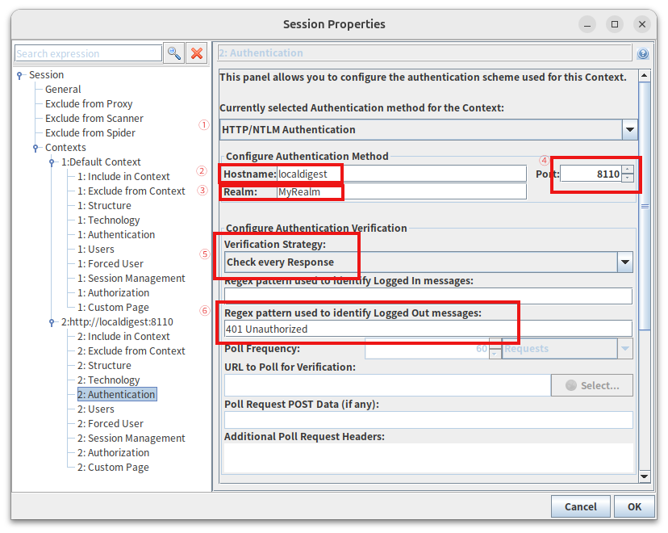
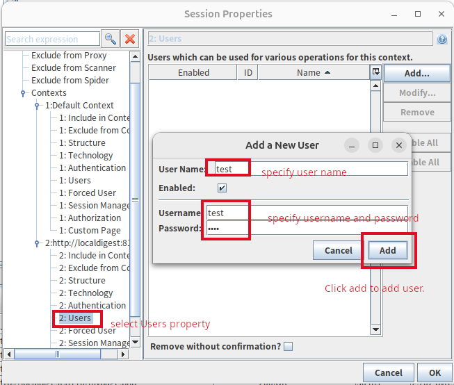
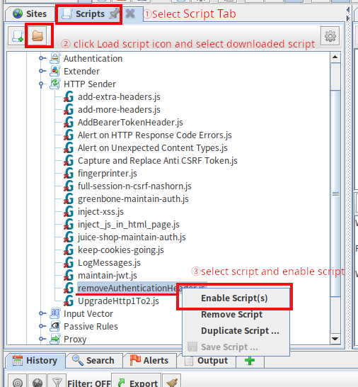
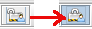

# WEBSAMPSQLINJ
A sample php web application with SQL injection everywhere :).  
Simple sample web application for learning SQL injection.
This sample application is a membership site for registering image files and their associated information.
This sample application consists of following items:  
* PHP
* Postgresql
* Apache 

### Prerequisite

* docker
* docker compose

### Sitemap

<PRE>
 *SQL - A PHP script that executes SQL statements. All SQL statements are vulnerable.
 *path - A php script that reads and displays the specified file
 
URL: http://localhost:8110/
     http://localdigest:8110/ (if you use Digest Authentication)

1.index.php(login page)
  |
  |-[Regist New User]->2-1.newuser.php-[Confirm]->2-2.newuser.php-[Complete]->2-3.newuser.php(*SQL)->[Login]->index.php
  |
  |-[Login]-->3.mypage.php(*SQL)
  |             |
  |             |-[Modify user]-->3.1.moduser.php-[Confirm]->3.2.moduser.php-[Complete]->3.3.moduser.php(*SQL)-[Return to MYPAGE]->mypage.php
  |             |
  |             |-[Regist entry]-->4.1.inquiry.php-[Confirm]->4.2.confirm.php-[Complete]->4.3.complete.php(*SQL)-[Return to MYPAGE]->mypage.php
  |             |                                                                       |
  |             |                                                                       |-[xxx.img]->4.4.showfile.php(*path)
  |             |
  |             |-[Show your registered Entry list]->5.1.inquirylist.php(*SQL)-[Search]->5.2.inquirylist.php(*SQL)-[Return to MYPAGE]->mypage.php
  |             |                                            |                          |
  |             |                                            |---------[xxx.img]---------->5.3.showfile.php(*path)
  |             |
  |             |
  |             |-[Revoke user]-->6.1.removeuser.php-[Revoke]->6.2.removeuser.php(*SQL)-[Login]->index.php
  |
  |-[Goto API login page]-->7./API/indexAPI.php-->/API/mypageAPI.php
  |-[Goto Shell test page]-->8.shell.html-->/cgi-bin/crazyeval.sh
</PRE>

### install & setup 

1. If your os does not have docker, Please read: https://docs.docker.com/get-docker/ and follow the instructions.

1. If you does not have "docker compose" tool, Please read: https://docs.docker.com/compose/install/
   1) Check whether did you get the "docker compose" tool
   <PRE>
   $ docker compose
     docker: 'compose' is not a docker command. <- no installed
       ..OR...
     Usage:  docker compose [OPTIONS] COMMAND <- You have it. installed.
   </PRE>
   2) if you don't have compose tool, read https://docs.docker.com/compose/install/ carefully, and follow the instructions.

1. download Source code WEBSAMPSQLINJ-N.N.N.tar.gz file from RELEASE page, and extract .tar.gz file, and create apache_php_pgsql/docker/db/data folder for database persistence
<PRE>
e.g. version number N.N.N is 0.5.0
$ tar xzvf WEBSAMPSQLINJ-0.5.0.tgz
$ cd WEBSAMPSQLINJ-0.5.0/apache_php_pgsql/docker/db
$ mkdir data
 </PRE>
or clone git and create dir.
<PRE>
$ git clone https://github.com/gdgd009xcd/WEBSAMPSQLINJ.git
$ cd WEBSAMPSQLINJ/apache_php_pgsql/docker/db
$ mkdir data
</PRE>

### start application
1. if your os did'nt start docker, Start docker using your OS method
<PRE>
e.g. (on Ubuntu 22.04)
$ sudo systemctl start docker
</PRE>

1. In apache_php_pgsql dir, execute following docker compose command.
<PRE>
 $ cd WEBSAMPSQLINJ/apache_php_pgsql
 $ sudo docker compose up -d
</PRE>
### stop application
1. In apache_php_pgsql dir, execute following docker compose command.
<PRE>
 $ cd WEBSAMPSQLINJ/apache_php_pgsql
 $ sudo docker compose down
</PRE>

### URL of application 
1. Access http://localhost:8110/ in your browser.

### Usage of application
#### HOW to use
1. refer http://localhost:8110/help.html

#### Digest Authentication
If you want to use Digest Authentication, you can do the following steps.

1. add entry of "127.0.0.1 localdigest"  to /etc/hosts file
2. Access http://localdigest:8110/ in your browser.
3. enter test/test as username/password

#### Configuring Digest Authentication in ZAPROXY
1. access as described in the "Digest Authentication" section above.
2. select site tree entry named http://localdigest:8110/ and right-click  
select menu Include Site In Context -> New Context
3. select "Authentication" property in newly created Context and setup as following image  

4. select "Users" property, add user as following image 

4. download [removeAuthHeader script](removeAuthenticationHeader.js)
5. paste script to ~/.ZAP/scripts/scripts/httpsender folder.
6. to enable script, load this script on script tab, setup as following image.  

7. enable forced user mode as following image.  

8. now you can send authenticated request with zaproxy. and you can configure any other BASIC/Digest/NTML authentication by using this method.

### Uninstall
if you are running this application, you must stop application using above instructions.
and follow the following steps.

1. delete docker images

       $ sudo docker images
       REPOSITORY             TAG       IMAGE ID       CREATED        SIZE
       apache_php_pgsql-web   latest    2b3513efbb49   22 hours ago   457MB
       postgres               15        4ff1e3b62d7d   3 months ago   426MB
       $ sudo docker rmi 2b3513efbb49
       $ sudo docker rmi 4ff1e3b62d7d

2. remove WEBAMPSQLINJ dir
 
       $ sudo rm -fr WEBSAMPSQLINJ

 

 
